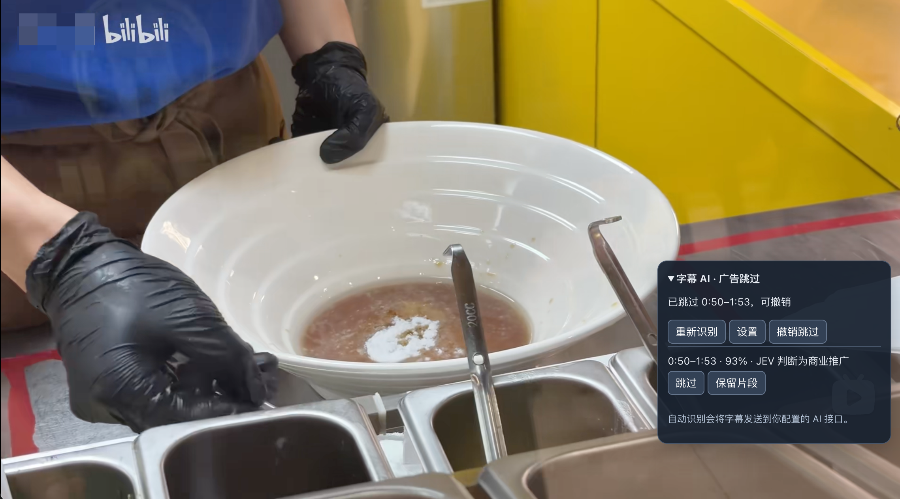
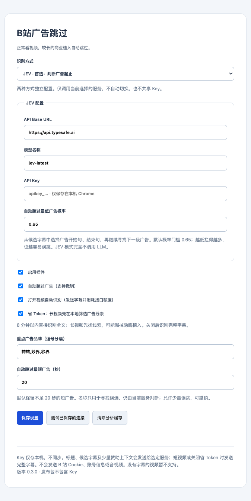
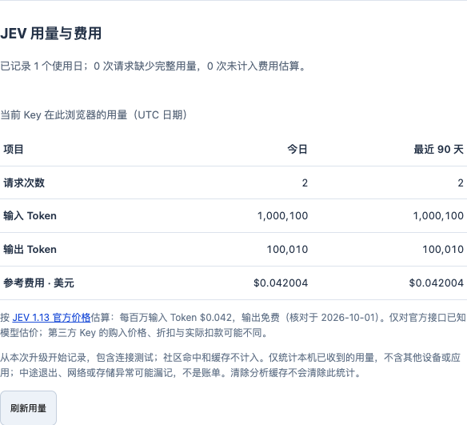

# B站广告跳过

正常看视频，遇到较长的植入广告时自动跳到广告结束的位置。误跳了可以一键撤销。

**[下载最新版插件](https://github.com/chenyanshan/bilibili-ad-skipper/releases/latest)** · [问题反馈](https://github.com/chenyanshan/bilibili-ad-skipper/issues)

适用于电脑端 Chrome 浏览器的 B 站普通视频页面。**不需要安装 Python、Node.js 或运行代码**；你只需要解压插件。社区广告标注不需要 API Key；想在没有社区广告时补充 AI 识别，再填写自己的 Key。AI 识别仅使用 **JEV**。

## 社区广告集成

本项目在现有小面板中接入 [BilibiliSponsorBlock（小电视空降助手）](https://github.com/hanydd/BilibiliSponsorBlock) 的[社区服务](https://www.bsbsb.top)，专注付费赞助广告的查询、跳过与投稿。集成开发记录见 [`feat/bilibili-sponsorblock-integration`](https://github.com/chenyanshan/bilibili-ad-skipper/tree/feat/bilibili-sponsorblock-integration)。源码更新和安装包发布分开进行，安装包以 [Releases](https://github.com/chenyanshan/bilibili-ad-skipper/releases/latest) 为准。

默认先查询社区的 **赞助/恰饭（sponsor）** 标注。有社区广告就直接采用，整支当前分 P 不调用 AI；只有没有广告标注时才使用JEV。其他类别不参与此判断。社区的整片广告标签或静音广告说明已有广告标注，但不会被当成可整片跳过的时间段。

不填写 Key 也能保存设置并使用社区广告。社区广告无需字幕，不套用 AI 的评分门槛或默认 20 秒最短时长。

## 实际效果



用户提供的实际使用截图：自动跳过 `0:50–1:53` 的商业推广，随后继续播放。截图来自早期版本，当前插件名称已统一为“B站广告跳过”。

## 安装：第一次使用跟着做

### 1. 下载并解压

1. 打开 **[最新版下载页面](https://github.com/chenyanshan/bilibili-ad-skipper/releases/latest)**。
2. 找到页面下方的 **Assets（附件）**，下载 **`bilibili-ad-skipper.zip`**。
3. 把 ZIP **解压到一个你准备长期保留的文件夹**，例如“文档/B站广告跳过”。打开这个文件夹，应能直接看到 `manifest.json`。

不要下载 GitHub 自动附带的 `Source code (zip)`，那是给开发者看的源码。不要直接把 ZIP 拖进浏览器，也不要加载完就删除解压文件夹——Chrome 运行插件时仍要读取这些文件。

### 2. 加载到 Chrome

1. 打开 Chrome，在**地址栏**粘贴 `chrome://extensions`，按回车。
2. 打开页面右上角的 **开发者模式**。
3. 点击左上角的 **加载已解压的扩展程序**。
4. 选择刚才解压的文件夹，也就是**直接包含 `manifest.json` 的那一层**。
5. 页面出现 **B站广告跳过**，并且开关已打开，就说明安装完成。

安装后，点击 Chrome 右上角的拼图图标 🧩，找到“B站广告跳过”，点旁边的图钉。这样插件图标就会一直显示在工具栏，方便打开设置。

> 这是本地加载方式，暂未上架 Chrome 应用商店。Chrome 显示“开发者模式扩展程序”的提示属于这种安装方式的正常表现。

## 配置 JEV

点击工具栏里的 **B站广告跳过** 图标，打开设置页。仅使用社区广告时，保持“使用社区广告标注”开启、Key 留空，直接保存即可。



历史配置截图；当前设置页还提供社区广告和独立投稿开关。

### 填写 JEV 配置

JEV 分块检查完整字幕，先判断有没有广告，再为疑似广告选择开始句、结束句；边界不确定时会复核，已确认广告还会检查前面的商业转场，减少从品牌句才开始跳过的情况。证据不足时保留原区间；仍可能因字幕或模型误差漏掉广告开头。

| 设置项 | 怎么填 |
|---|---|
| API Base URL | 保持 `https://api.typesafe.ai` |
| 模型名称 | 保持 `jev-latest` |
| API Key | 粘贴你自己的完整 JEV Key，通常以 `apikey_` 开头 |
| 自动跳过最低广告概率 | 初次使用保持 `0.65` |

1. 填完点击 **保存设置**。
2. 再点击 **测试已保存的连接**。
3. 出现 **JEV 连接成功**，就可以去看视频了。

用户提供的价格参考：闲鱼上“5 刀 JEV Key 不到 2 元人民币”。这是未核验的第三方报价，不是官方售价，也不代表本项目验证或推荐该卖家。

API Key 可以理解为接口的使用凭证，需要你从相应服务商获取。本插件**不附送 Key 或接口额度**。已有 Key 的人不需要再注册另一套模型服务。接口调用可能消耗你的额度。

### 查看 Token 和费用



实际设置页截图，使用测试样本数据演示统计，不代表真实账单。

设置页的“JEV 用量与费用”显示当前 Key 在此浏览器中**最近 24 小时、最近 7 天、最近 30 天**的请求次数、输入/输出 Token 和参考费用，点击“刷新用量”更新。

按 [官方模型价格](https://docs.typesafe.ai/models)（2026-10-01 核对），JEV 1.13 每百万输入 Token 为 **0.042 美元，输出免费**。例如 100 万输入、10 万输出 Token，参考费用为 0.042 美元。仅对官方接口返回的已知模型估算；自定义接口或未知模型显示未估价。第三方 Key 的实际购入成本、折扣和扣款以服务商为准。

滚动统计从本次升级开始，旧版每日汇总不混入。包含连接测试，不计社区命中和缓存。按请求发出时间滚动统计，Key 或接口不同分别记录；不含其他设备、应用或本次升级前的用量。失败、缺失用量、未估价的请求会标明；中途关闭或存储异常可能漏记，不能作为账单。清除分析缓存不会清除用量记录。目前没有接入余额查询或剩余天数预测。

升级会保留已有 JEV 地址、模型、Key 和开关。旧版 LLM 选择不再生效，也不会把 LLM Key 当作 JEV Key；未填 JEV Key 时只使用社区标注。下次保存设置会清除旧 LLM 配置字段。

## 开始观看

1. 正常打开一个 B 站视频，例如地址形如 `https://www.bilibili.com/video/BV…/`。
2. 如果安装前这个视频页就已经打开了，先**刷新一次页面**。
3. 插件先查询社区广告；没有广告标注且已配置 Key 时，再读取字幕并识别。**不用点击“分析”或“重新识别”**。
4. 右下角会出现可折叠的 **广告跳过** 面板。识别完成后，播放到广告段会自动跳过去。

默认设置已经适合直接使用：

- **自动识别、自动跳过均开启**。
- **AI 识别中不足 20 秒的短广告默认保留**，社区广告按社区区间跳过。
- 误跳时点 **撤销跳过**，恢复到刚才的位置；这个片段本次不会再自动跳过。
- 想完整看某一段，点 **保留片段**。
- **重新识别**会重新查询社区；仍无社区广告时可能再次调用 AI、消耗额度。失败保留已有广告结果，不无限重试。

识别需要一些时间，视频不会暂停等待。片头很早出现的广告，可能在识别完成前已经播放过去。

### 想调整效果？

| 情况 | 可以怎么调 |
|---|---|
| 想多拦一些，接受偶尔误跳 | 适当降低 JEV 广告概率门槛 |
| 经常把正片误跳 | 提高判断门槛，或关闭自动跳过后手动操作 |
| 只想处理 1 分钟以上的长广告 | 把“自动跳过最短广告”改为 `60` 秒 |
| 某些常见品牌总是漏掉 | 加入“重点广告品牌”，用逗号分隔 |
| 长视频里的隐晦推广经常漏掉 | JEV 已分块检查全文。没有字幕的广告仍无法识别 |

默认重点品牌包括转转、妙界及可能的字幕误写“秒界”。**提到品牌不等于广告**，仍由选定服务判断。插件偏向多拦广告，但不能保证识别完整、边界准确或完全不误跳。

## 投稿广告给社区

AI 候选旁的“手动投稿”会公开广告起止时间。先检查或保留误识别片段；社区来源的行无需再次投稿。投稿不包含字幕或 AI Key，使用插件在本机生成的匿名社区 ID。

“自动投稿符合条件的 JEV 广告”默认关闭，需单独开启。只有 JEV 广告概率、起止置信度和所选边界概率**全部 ≥90%**，且片段已被实际自动跳过，才尝试投稿。同一视频区间有本机去重；失败不会自动重试，保留或撤销后不会再自动尝试。撤销或保留可停止尚未发出的自动投稿；已经发出的公开投稿无法通过撤销跳过收回。界面会显示投稿中、成功、重复或失败，可手动处理失败。

## 常见问题

### 没有跳过，是不是没安装成功？

先展开右下角面板，看它的状态。常见原因包括：没有配置 Key、接口请求失败、视频没有字幕、未发现广告、广告太短，或识别还没完成。确认设置中的“启用插件”“打开视频自动识别”“自动跳过广告”均已勾选。

### 提示没有字幕怎么办？

社区没有标注、已配置 AI 且首次没读到字幕时，插件会自动尝试开启播放器的中文 AI 字幕，重新读取后恢复原来的开关状态；不需要你手动开关。你本来已开启的字幕会保持开启。

如果仍提示没有字幕，请确认 B站已登录后重试。有些视频没有 AI 字幕入口，或 B站尚未提供字幕，开关也无法强制生成；这时暂不能用 AI 识别，社区广告仍然可用。本插件不下载音频，也不额外做语音转录。

### 测试连接报错怎么办？

- **401**：检查 Key 是否完整、是否属于当前所选服务、是否已失效。
- **404**：检查地址是否填错；JEV 使用上表默认地址即可。
- **422**：检查模型或服务接口是否兼容。
- **429 / 529 / 超时**：服务限流、繁忙或网络异常，稍后再试。

填完或修改配置后，先保存再测试。不要把自己的 Key 贴到 Issues 或截图里。

### 更新插件怎么做？

设置页现在提供“插件更新”：默认每天检查 GitHub 正式版本，也可手动检查；发现新版时插件图标显示 **↑**。只检查版本，不发送 Key、字幕或观看记录，不会自动安装。

**从没有升级功能的旧版升级，需要先按下面的下载方式手动更新一次。** 之后可以使用原地升级：

1. 在设置页点“准备原地升级”，等待安装包下载和校验完成。
2. 首次展开“原地升级设置”，点“选择原安装文件夹”，选择 Chrome 当前加载、直接包含 `manifest.json` 的文件夹，并允许写入。不能选择 ZIP 或另一份副本。
3. 点“安装并重新加载”。插件会先备份被覆盖文件，写入后校验，再重新加载；已有 Key、设置和用量保持。之后刷新已打开的 B站视频页。

文件夹记录会保存在本机，浏览器仍可能再次请求写入许可。更新时保持页面开启，不要同时修改安装目录。正常写入失败会尝试回退，也提供“恢复上次备份”；若浏览器崩溃或写入权限失效，可使用下方下载方式恢复。新版新增权限或不支持文件夹授权时也使用下载方式。Chrome 商店式静默升级不适用于当前“加载已解压扩展”的安装方式。

更多限制和验证范围见 [升级说明](docs/UPDATES.md)。

**下载升级 / 故障恢复：**

1. 去 [Releases](https://github.com/chenyanshan/bilibili-ad-skipper/releases/latest) 下载新版 `bilibili-ad-skipper.zip`。
2. 关闭或暂停正在播放的视频，把新 ZIP 解压后的文件**覆盖到原插件文件夹**。
3. 打开 `chrome://extensions`，找到本插件，点击卡片上的 **刷新/重新加载** 图标。
4. 刷新 B 站视频页面。

**保留原文件夹路径，不要先卸载插件**，这样已有配置和 Key 通常可以继续保留。卸载插件会清除它的本地配置。如果改了文件夹路径，需要重新加载，可能被 Chrome 当作另一个插件。

### 支持哪些视频？

目前支持电脑端 B 站普通 BV 视频页，包括 `?p=` 分 P。直播、番剧、嵌入播放器、播放列表专用页面暂不支持；没有字幕、只有画面没有口播的广告也可能识别不到。

## 隐私和额度

- Key 仅保存在你当前 Chrome 的本地扩展存储，不上传到开发者服务器，也不使用 Chrome 同步。
- 视频标题、需要判断的字幕及少量上下文会发送给你配置的 **JEV 服务商**。不会发送 B 站 Cookie、账号登录信息或音视频文件。
- 默认长视频先在本地筛选候选，不超过 8 分钟的视频直接检查全文。AI 结果（包括本次未发现广告）仅在本机缓存 7 天，最多保存 100 份；不会向社区投稿“无广告”。失败或未完成不视为“无广告”。设置中可以清除分析缓存。
- 社区查询发送视频标识，社区投稿发送区间、分类、时长和匿名社区 ID；不会发送 AI Key、字幕或 B 站 Cookie。匿名 ID 和投稿去重记录保存在本机，清除分析缓存不会删除它们。
- JEV 全文检查比旧版关键词筛选发送更多字幕、消耗更多额度。每次最多 24 个请求；达到预算或边界仍不确定时，会提示未检查完，只保留已确认的片段。不能把字幕字符数直接当成 Token 或费用。

详见 [隐私说明](docs/PRIVACY.md)。

## 开发与自动打包

开发者需要 **Node.js 22+、Python 3**。项目没有 npm 依赖，不需要安装依赖：

```bash
git clone https://github.com/chenyanshan/bilibili-ad-skipper.git
cd bilibili-ad-skipper
npm run check
npm test
npm run build
```

Chrome 开发调试时加载 `extension/`。打包结果在 `dist/`，包含带版本的 ZIP、稳定文件名 ZIP 和 SHA256 校验文件。

| GitHub 操作 | 自动发生什么 |
|---|---|
| 推送 `main` 或提交 PR | 检查、测试、打包，在 Actions 上传测试附件 |
| 推送与 manifest 版本一致的 `vX.Y.Z` 标签 | 检查、打包，并在 Releases 发布可安装 ZIP |
| 手动运行 Release extension，填写已存在的 tag | 重试该版本的打包/上传 |
| 更新当前版本的发布说明并推送 `main` | 同步到已发布 Release 的正文，保留原安装包 |

维护者更新版本使用 `npm run version:set -- X.Y.Z`，它会同步两处版本号。各版本更新说明保存在 [docs/releases/](docs/releases/)，发布前需准备对应的 `vX.Y.Z.md`，说明功能变化、默认行为、升级方法和验证结果。**只推 main 不会发布新版本安装包**。完整的标准更新步骤、失败恢复和禁止事项见 [AGENTS.md](AGENTS.md)。

本轮真实对照及已知不足：[JEV 全文识别评测](docs/JEV-EVALUATION-2026-10-01.md)。

更多技术记录：[JEV 接入与实测](docs/JEV.md) · [字幕研究与局限](docs/RESEARCH.md) · [商店发布准备](docs/PUBLISHING.md)
## 社区交流

[LINUX DO](https://linux.do/)：项目交流与反馈。
